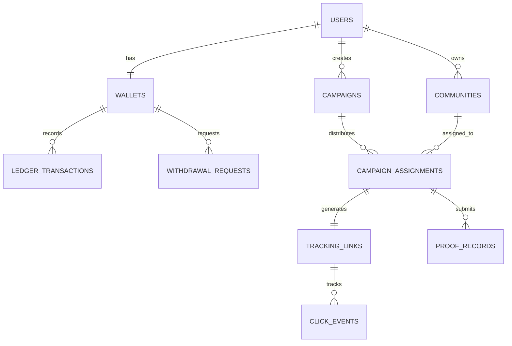

# Adision — Master Project & System Context

> **Official Positioning:** Performance-driven Community Advertising Marketplace  
> **Launch Distribution Channel:** WhatsApp Groups & Channels  
> **Tagline:** *"Reach the right communities"*  
> **Document Version:** 1.0.0 (Living Context Document)

---

## 1. Executive Summary & Core Value Proposition

**Adision** connects businesses/advertisers wanting targeted reach with verified owners of digital communities (starting with WhatsApp Groups & Channels).

### The Two-Sided Marketplace
```
┌─────────────────────────────────────────┐          ┌─────────────────────────────────────────┐
│           DEMAND (Advertisers)          │          │       SUPPLY (Community Partners)       │
├─────────────────────────────────────────┤          ├─────────────────────────────────────────┤
│ • Small businesses, startups, creators  │          │ • WhatsApp Group & Channel Admins       │
│ • Frustration: manual DMing, scam risk, │  ──────> │ • Frustration: large audience but zero │
│   zero click analytics, no placement    │  ADISION │   organized/predictable monetization    │
│   verification.                         │  <────── │ • Value: steady ad jobs, auto tracking, │
│ • Value: 1-click campaign, verified     │          │   guaranteed payouts to bank wallet.    │
│   reach, unique click tracking reports. │          │                                         │
└─────────────────────────────────────────┘          └─────────────────────────────────────────┘
```

---

## 2. Pre-Mortem Analysis: If ADISION Fails, Why Did It Happen?

A **Pre-Mortem** assumes the product has already launched and failed 12 months from now. We examine the exact vulnerabilities that caused the failure and our proactive mitigations:

| # | Failure Mode (Root Cause) | Real-World Vulnerability | Proactive Mitigation Strategy |
| :--- | :--- | :--- | :--- |
| **1** | **Supply-Side Deletion & Laziness (Cheating)** | Group admins post the advert, take a screenshot, and immediately delete it or let members spam over it. | **Mitigations:**<br>1. *Performance Score:* If a group generates 0 clicks consistently, their score drops and they get zero future campaigns.<br>2. *Proof Rules:* Require timestamped proof + post must stay active for required duration (e.g. 24h/48h).<br>3. *Random Admin Spot Checks:* Platform admins join sample groups to verify ad persistence. |
| **2** | **Phantom / Ghost Audiences (Dead Groups)** | Groups have 1,000 members, but 95% are bots, inactive numbers, or silent lurkers. | **Mitigations:**<br>1. Mandatory verification includes activity signals (recent group message activity, not just member count).<br>2. Tracking clicks via unique links measures *actual engagement*, not vanity follower counts. |
| **3** | **Chicken-and-Egg Liquidity Problem** | Advertisers don't spend because there aren't enough verified groups; group admins abandon the platform because there aren't enough ad assignments. | **Mitigations:**<br>1. *Pre-seed Supply First:* Onboard and verify 50–100 active niche groups (Tech, Crypto, Campus, VTU) before launching public advertising.<br>2. *Guaranteed Seed Campaigns:* Launch with introductory advertiser packages or partner brand sponsorships. |
| **4** | **Platform Disintermediation (Two-Way Side-Deals)** | 1. Advertisers find group names and contact admins directly.<br>2. WhatsApp admins click the ad link, find the advertiser's number/IG, and message them directly saying: *"Pay me directly next time for cheaper!"* | **Mitigations:**<br>1. *Blind Marketplace:* Advertisers never see admin phone numbers or group invite links.<br>2. *The Scale & Convenience Defense:* An advertiser uses Adision to reach 20 groups with 1 transfer and 1 report. They do NOT want the headache of chatting with, bargaining with, and chasing 20 random WhatsApp admins for screenshots.<br>3. *The Escrow Defense:* Admins stay on Adision because they get guaranteed escrow payment. In direct deals on WhatsApp, 60% of small clients scam or ghost admins after the ad is posted.<br>4. *Link Cloaking:* Ad copy drives to clean tracking links (`/r/[code]`), disallowing raw personal numbers in ad body copy.<br>5. *Strict Anti-Poaching Rule:* Any admin caught contacting an advertiser for side-deals suffers immediate account banning and forfeiture of pending wallet balance. |
| **5** | **WhatsApp Platform Risk (Policy/Bans)** | WhatsApp introduces friction or limits spam links. | **Mitigations:**<br>1. Clean, human-friendly redirect domains with SSL.<br>2. Strict ad copy standards (no illegal VTU/ponzi/spam schemes).<br>3. Architecture designed from day one to expand to Telegram, Discord, and campus newsletters. |
| **6** | **Payment & Cash-Flow Friction** | Advertisers abandon checkout due to card failure; partners complain of delayed withdrawals. | **Mitigations:**<br>1. Integrate **PaymentPoint Virtual Accounts (Bank Transfer)** which has >95% success rate in Nigeria.<br>2. Clear automated wallet balance & quick withdrawal processing. |

---

## 3. The "Zero-Budget Enterprise" Principle: 100% Free Stack (Domain Only)

> **Core Operating Rule:** The **ONLY** money ever spent on this project is the custom domain name (e.g. `adision.co` or `adision.ng`).  
> Every piece of software, hosting, database, security, and storage architecture MUST permanently operate within robust free tiers while maintaining enterprise-grade cybersecurity.

### Free-Tier Capacity Breakdown:

```
┌──────────────────┬──────────────────────┬──────────────────────────────────────────┐
│ Service          │ Free Tier Limit      │ What This Means for ADISION              │
├──────────────────┼──────────────────────┼──────────────────────────────────────────┤
│ Next.js (Vercel) │ 100GB bandwidth/mo,  │ Handles 50,000+ monthly page views and   │
│                  │ unlimited deploys    │ fast API/Edge redirects easily for free. │
├──────────────────┼──────────────────────┼──────────────────────────────────────────┤
│ Supabase DB      │ 500 MB PostgreSQL    │ Stores ~250,000 transactions, campaigns, │
│                  │                      │ assignments, and user records.           │
├──────────────────┼──────────────────────┼──────────────────────────────────────────┤
│ Supabase Auth    │ 50,000 MAU           │ 50,000 registered users without paying   │
│                  │                      │ a single cent.                           │
├──────────────────┼──────────────────────┼──────────────────────────────────────────┤
│ Supabase Storage │ 1 GB Object Storage  │ Stores ~5,000 optimized proof/ad images  │
│                  │                      │ (using WebP compression before upload).  │
├──────────────────┼──────────────────────┼──────────────────────────────────────────┤
│ Resend (Emails)  │ 3,000 emails/month   │ Handles ~100 transactional emails/day.   │
├──────────────────┼──────────────────────┼──────────────────────────────────────────┤
│ PaymentPoint     │ Free sandbox/account │ Zero monthly subscription; standard small│
│                  │                      │ transaction % fee only on live payments. │
└──────────────────┴──────────────────────┴──────────────────────────────────────────┘
```

> **When do you ever need to pay?**  
> Only when you exceed 50,000 users or 500MB database storage — at which point the platform will already be generating substantial revenue to easily cover standard cloud bills.

---

## 4. Security & Cybersecurity Architecture

To protect funds, user privacy, and data integrity, ADISION enforces enterprise-grade security standards across 6 layers:

```
                  ┌──────────────────────────────────────────────────────────┐
                  │                   SECURITY PERIMETER                     │
                  └────────────────────────────┬─────────────────────────────┘
                                               │
    ┌──────────────────────┬───────────────────┴──────────────────┬──────────────────────┐
    ▼                      ▼                                      ▼                      ▼
┌──────────────────┐ ┌──────────────────────────┐ ┌────────────────────────┐ ┌──────────────────┐
│ 1. Auth & RBAC   │ │ 2. Atomic Wallet Ledger  │ │ 3. Anti-Fraud Redirect │ │ 4. Webhook Auth  │
│ • Supabase RLS   │ │ • ACID Transactions      │ │ • IP / UA Hashing      │ │ • HMAC Signature │
│ • Multi-role JWT │ │ • Prevents double-spend  │ │ • Rate limiting / Dedupe│ │ • Secret Verify  │
│ • Secure cookies │ │ • Immutable audit logs   │ │ • Bot filtering        │ │ • Idempotency key│
└──────────────────┘ └──────────────────────────┘ └────────────────────────┘ └──────────────────┘
```

### 1. Row Level Security (RLS) & Multi-Role Isolation
* PostgreSQL Row Level Security is enabled on **all tables**.
* **Advertisers** can ONLY read/write their own campaigns and billing records.
* **Community Partners** can ONLY see their assigned jobs and personal wallet data.
* **Admins** have audited role-checked overrides.

### 2. Double-Entry Financial Ledger (No Floating Balances)
* Wallet balances are never updated via simple arbitrary arithmetic (`balance = balance + amount`).
* Instead, balance changes require an **immutable ledger transaction entry** inside an ACID Postgres transaction with row-level locks (`SELECT ... FOR UPDATE`).
* This eliminates race conditions, duplicate payouts on double-clicks, and accidental negative balances.

### 3. PaymentPoint Webhook Verification & Idempotency
* All incoming webhook requests to `/api/webhooks/paymentpoint` are verified against the cryptographic secret / signature.
* Every webhook transaction carries an **Idempotency Key** (`transaction_ref`). If PaymentPoint retries the same webhook 3 times, ADISION processes it exactly once.

### 4. Anti-Fraud Click Tracking Engine
* Each click through `/r/[trackingCode]` captures:
  * Anonymized SHA-256 hash of `(IP Address + User Agent + Salt)` (complies with GDPR/privacy, stores no raw IP).
  * Deduplication window: Repeated clicks from the same device within a short window count as `raw_clicks` but only `1 unique_click`.
  * Basic bot/crawler user-agent filtering.

### 5. Media Upload Security
* Client-side image validation (size limits: max 3MB, MIME types: PNG, JPEG, WebP only).
* Automatic WebP compression before uploading to reduce storage footprint by 70-80%.
* Private signed URLs for sensitive verification/KYC documents.

---

## 5. Domain Data Model & Entity Relationship



---

## 6. Current Development & System Status

- **Brand & Identity:** Strictly branded as **Adision** across all interfaces, metadata, and backend schemas.
- **UI & Experience:**
  - **Dual Light / Dark Mode:** Fully functional persistent theme toggle (Sun/Moon in Navbar). Light mode uses crisp white/slate backgrounds with vibrant brand green (`#8fc822`); dark mode uses high-contrast obsidian (`#0d0f12`) and emerald.
  - **Clean Early Access Waitlist (`/waitlist`):** Dual-role signup form for Advertisers and Community Partners, collecting Full Name, Email, WhatsApp Phone, Country, and Business/Community details. Truthful, plain-English value propositions (no fabricated bonuses or ambiguous claims).
  - **Admin Waitlist Management (`/admin/waitlist`):** Operations portal to view, filter by role/country, search signups, copy all WhatsApp phone numbers in 1 click, and export complete CSV reports.
  - **Role-Based Auth System (`/login`, `/signup`):**
    - Built on top of Supabase Auth with persistent session context (`src/lib/auth/auth-context.tsx`).
    - Route guards (`AuthGuard.tsx`) protect private dashboards:
      - `/admin/*` strictly requires `role = 'ADMIN'`. Unauthorized visitors are redirected to `/login`.
      - `/advertiser/*` requires `role = 'ADVERTISER'` or `'ADMIN'`.
      - `/partner/*` requires `role = 'COMMUNITY_PARTNER'` or `'ADMIN'`.
    - Profile auto-generation on signup handled by Supabase trigger in `003_auth_profiles_trigger.sql`.
- **Security & Backend:**
  - `002_waitlist_schema.sql` (standalone waitlist) and `000_FULL_SETUP.sql` (all-in-one idempotent master migration).
  - `003_auth_profiles_trigger.sql` (auth trigger + `public.make_user_admin(email)` helper).
  - HMAC SHA-256 webhook signature verification with timing-safe comparisons in place.
  - Bot and preview-scraper filtering active on `/r/[code]` redirect engine.
  - Atomic PostgreSQL stored procedures for campaign payment escrow, click incrementing, and balance withdrawals.
- **Live Deployment & Credentials:**
  - Production App URL: `https://adisionads.vercel.app`
  - Supabase Project ID: `rgivzqyqcrhqafcxbvfd`
  - `.env.local` configured with Supabase URL, anon key, and service role key.

---

## 7. Strict Founder Directives & Truth-in-Marketing Policy

> [!CAUTION]
> **MANDATORY POLICY FOR ALL FUTURE DEVELOPMENT & AI ASSISTANCE:**
> 1. **Zero Fabricated Data or Perks:**
>    - **NEVER** invent promo percentages, fake credits, or discounts (e.g., do NOT invent "20% bonus ad spend" or "0% commission for 30 days").
>    - **NEVER** invent fake guarantees (e.g., do NOT invent "guaranteed seed campaigns" or "escrow-backed guarantee").
>    - **NEVER** create fake gamification rules (e.g., do NOT claim "inviting a friend jumps you 5 spots" unless backend queue reordering is explicitly implemented and requested).
> 2. **No Ambiguous Buzzwords:**
>    - Avoid vague jargon like "escrow-backed guarantee" or unverified claims.
>    - If the user or founder hasn't explicitly told you a perk or policy exists, **DO NOT ADD IT**.
>    - Speak in plain, honest, and factual language at all times:
>      - *Advertisers:* Launch campaigns across vetted WhatsApp communities with unique click tracking.
>      - *Partners:* Monetize active WhatsApp groups/channels with direct bank payouts upon verified proof.
> 3. **Authentication & Access Rules:**
>    - Never allow open unauthenticated browsing into `/admin`, `/advertiser`, or `/partner`.
>    - Elevating a user to Admin is done strictly via Supabase SQL: `SELECT public.make_user_admin('founder@example.com');`.
> 4. **Payment Flow Roadmap:**
>    - Payment gateways (PaymentPoint) will be wired into live production after account creation and dashboard flows are fully vetted.


