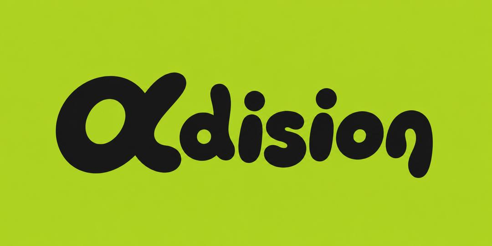

# Adision

<p align="center">
  
</p>

<p align="center">
  <strong>Performance-Driven Community Advertising Marketplace</strong><br />
  <em>Reach the right communities.</em>
</p>

---

## 🌟 Overview

**Adision** connects advertisers seeking high-converting, targeted reach with verified owners of WhatsApp Groups, WhatsApp Channels, and digital communities.

### Key Capabilities:
- **For Advertisers**: Multi-step campaign builder, real-time live WhatsApp message preview, safe payment protection (funds held safely until your ad is posted), unique link click attribution, and detailed outcome analytics.
- **For Community Partners**: Monetize WhatsApp audiences, receive broadcast tasks, submit screenshot proof of placement, and withdraw earnings directly to any Nigerian bank account.
- **For Operators/Admins**: Review community submissions, match campaigns to WhatsApp groups, 1-click proof approval with atomic wallet crediting, and financial disbursement audits.
- **PocketFi & Virtual Account Integration**: Dynamic dedicated Virtual Bank Accounts (Kuda Bank, 9PSB, SafeHaven) & hosted web checkout with automated SHA-512 webhook reconciliation.

---

## 🏗️ Tech Stack ($0 Free Tier Architecture)

- **Frontend & Full-Stack**: [Next.js 15](https://nextjs.org/) (App Router, React 19, TypeScript)
- **Styling & UI**: [Tailwind CSS](https://tailwindcss.com/) + [Lucide Icons](https://lucide.dev/)
- **Database & Auth**: [Supabase](https://supabase.com/) (PostgreSQL with Row Level Security & Atomic Triggers)
- **Payment Gateway**: [PocketFi](https://pocketfi.ng/) (Dedicated Virtual Accounts & Instant Webhooks)
- **Email Notifications**: [Resend](https://resend.com/)
- **Hosting**: [Vercel](https://vercel.com/) (Zero-cost hobby tier)

---

## 🚀 Getting Started

### 1. Clone & Setup
```bash
git clone https://github.com/adisionads/adisionads.git
cd adisionads
```

### 2. Environment Configuration
Copy the example environment template:
```bash
cp .env.example .env.local
```
*(The application includes rich mock data and sandboxed API clients so you can test all workflows locally even before entering production keys!)*

### 3. Install Dependencies
```bash
npm install
```

### 4. Run Development Server
```bash
npm run dev
```
Open [http://localhost:3000](http://localhost:3000) in your browser.

---

## 📁 Project Structure

```
├── public/
│   └── brand/                   # Official ADISION brand assets & logos
├── src/
│   ├── app/
│   │   ├── (public)/            # Landing page, pricing, calculator
│   │   ├── (portals)/
│   │   │   ├── advertiser/      # Advertiser campaign builder & live click charts
│   │   │   ├── partner/         # Community registry, task inbox & wallet
│   │   │   └── admin/           # KYC review, matchmaking, proof approval & payouts
│   │   ├── r/[code]/            # High-speed privacy-safe click redirect engine
│   │   └── api/webhooks/        # PaymentPoint webhook receiver
│   ├── components/
│   │   ├── ui/                  # Buttons, Cards, Modals, Inputs, Badges
│   │   ├── shared/              # Navbar, Footer, StatsCard, StatusBadge
│   │   └── previews/            # Live interactive WhatsApp chat mockup
│   ├── lib/
│   │   ├── paymentpoint/        # PaymentPoint API client
│   │   ├── store/               # In-memory mock data & reactive state store
│   │   ├── supabase/            # Supabase PostgreSQL client & types
│   │   └── utils.ts             # Currency, tracking code, and formatting helpers
│   └── types/                   # TypeScript interfaces for all domain entities
└── supabase/
    └── migrations/              # Production SQL schema & atomic ledger stored procedures
```

---

## 🔒 Security Highlights

1. **Double-Entry Financial Ledger**: PostgreSQL ACID transactions with row-level locks prevent race conditions and ensure zero balance discrepancies.
2. **Anti-Fraud Click Tracking**: SHA-256 IP/User-Agent telemetry hashing with window deduplication protects against bot click spamming.
3. **Row-Level Security (RLS)**: Strict database tenant boundaries isolate advertiser campaigns, partner jobs, and admin controls.

---

## 📄 License & Brand Notice

© 2026 **Adision**. All rights reserved.

